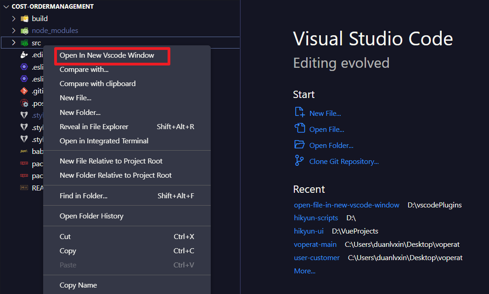
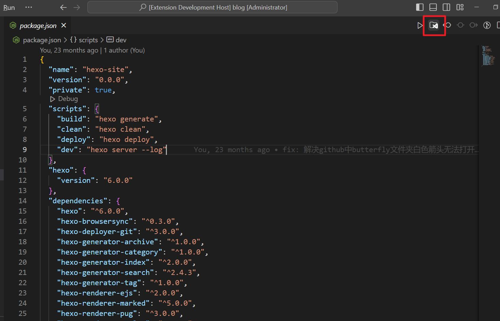
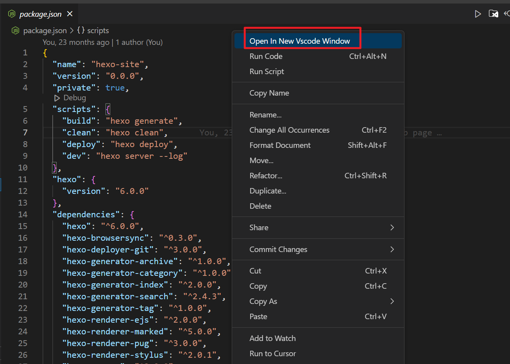

# open-file-in-new-vscode-window README

1、Right-click the file/folder to open it in the new vscode window.
2、Click the function Button in editor/title to open current file in new vscode window.
3、Right-click the function button to open current file in new vscode window.

## Features

## Known Issues

Calling out known issues can help limit users opening duplicate issues against your extension.

## Release Notes

### 1.1.0

1、Add function button in editor/title
2、Add function button in editor/context

### 1.0.0

Initial release of open-file-in-new-vscode-window

